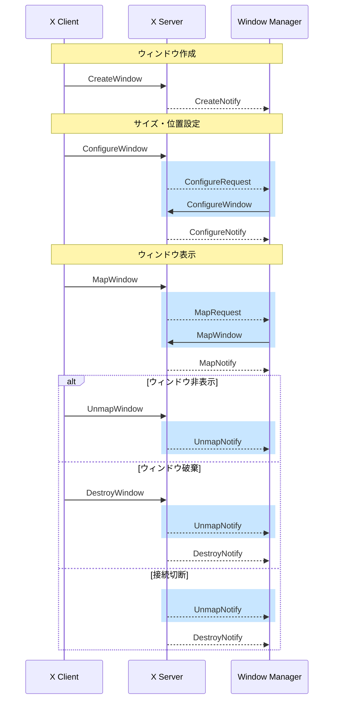

## はじめに

この章では、Window Manager の基本的な仕組みを理解し、実装します。

Window Manager は、X サーバーからリダイレクトされたウィンドウ操作に関するリクエストを処理する X11 のクライアントと言えます。この章では、シンプルな Window Manager を実装することで、以下を学びます。

- Window Manager がどのようにイベントを受け取るか
- 基本的なイベント (MapRequest, ConfigureRequest, UnmapNotify) の役割と処理方法

第 1 章で学んだ SubstructureRedirect の仕組みと、第 2 章で実装した X サーバーへの接続を組み合わせて、実際に動作する Window Manager を作成します。

## Window Manager の初期化

Window Manager が、ウィンドウ操作に関するイベントを受け取るためには、root window に対して SubstructureRedirect と SubstructureNotify のイベントマスクを設定する必要があります。

イベントマスクは、クライアントが特定のウィンドウについてどのイベントに関心があるかを指定するもの (ビット列) です。例えば、あるウィンドウに KeyPress マスクを設定すると、そのウィンドウでのキー入力をイベントとして受け取れます。

Window Manager の観点では、以下の 2 つのイベントマスクが重要です。

- SubstructureRedirect: あるウィンドウ (及びその配下) で発生したリクエスト (ウィンドウの作成、サイズ変更など) を Window Manager にリダイレクトします
- SubstructureNotify: あるウィンドウ (及びその配下) で発生した Notify (ウィンドウの非表示、削除など) を Window Manager に通知します

これらのイベントマスクを root window に設定することで、Window Manager はウィンドウ管理に必要なイベントをサーバーから取得します。

:::message
イベントマスクには他にも KeyPress (キー入力)、ButtonPress (マウスクリック)、EnterWindow (ポインタの出入り) など、様々な種類があります。全てのイベントマスクは [X11 Protocol の Common Types](https://www.x.org/releases/X11R7.7/doc/xproto/x11protocol.html#Common_Types) で定義されています。
:::

それでは、SubstructureRedirect と SubstructureNotify を root window に設定するコードを実装しましょう。

```rust
let event_mask = EventMask::SUBSTRUCTURE_REDIRECT | EventMask::SUBSTRUCTURE_NOTIFY;
let change = ChangeWindowAttributesAux::default().event_mask(event_mask);
conn.change_window_attributes(screen.root, &change)?
    .check()?;
```

`change_window_attributes` で root window に対して SubstructureRedirect と SubstructureNotify のイベントマスクを設定しています。これらのイベントマスクは、第 1 章で学んだように、同時に 1 つのクライアントしか設定できません。既に別の Window Manager が動作している場合、`change_window_attributes` はエラーを返します。

## イベントループの実装

前のセクションで設定した SubstructureRedirect/Notify マスクにより、Window Manager は以下のようなイベントを受け取れるようになります。

- MapRequest: ウィンドウの表示リクエスト
- ConfigureRequest: サイズ・位置変更リクエスト
- UnmapNotify: ウィンドウの非表示通知

イベントループを、以下の流れで実装します。

1. `wait_for_event()` でイベントを待機
2. イベントを受け取ったら `handle_event()` で処理
3. 1 と 2 を無限に繰り返す

これを実装したのが `run()` メソッドです。

```rust
fn run(&mut self) -> Result<()> {
    loop {
        self.conn.flush()?;
        let event = self.conn.wait_for_event()?;

        if let Err(e) = self.handle_event(&event) {
            error!("Failed to handle event: {:?}", e);
        }
    }
}

fn handle_event(&mut self, event: &Event) -> Result<()> {
    match event {
        Event::MapRequest(e) => self.handle_map_request(e)?,
        Event::ConfigureRequest(e) => self.handle_configure_request(e)?,
        Event::UnmapNotify(e) => self.handle_unmap_notify(e)?,
        _ => debug!("[Unhandled] {:?}", event),
    }

    Ok(())
}
```

`wait_for_event()` は、イベントが発生するまでブロックします。イベントが発生したら、`handle_event()` でイベントの種類に応じて適切な処理を呼び出します。

X11 では、クライアントからのリクエストは出力バッファに一旦保存され、まとめて送信されます。`flush()` を呼び出すことで、バッファに溜まったリクエストを X サーバーに送信できます。

イベントループの最初で `flush()` を呼ぶことで、前回のイベント処理で発行したリクエストが確実に X サーバーに届くようにしています。


## 基本的なイベントのハンドリング

この章で実装する Window Manager は、クライアントからのリクエストに応じてウィンドウのサイズや位置を設定・表示し、ウィンドウが非表示になったことを検知するシンプルなものです。この機能を実装するために、ConfigureRequest (サイズ・位置設定)、MapRequest (表示)、UnmapNotify (非表示通知) の 3 つのイベントを処理します。

以下のシーケンス図は、ウィンドウのライフサイクル全体を示しています。青色の部分が本章で扱うイベントです。



| イベント | 説明 |
|---------|------|
| ConfigureRequest | クライアントがウィンドウのサイズや位置を変更しようとした |
| MapRequest | クライアントがウィンドウを表示しようとした |
| UnmapNotify | ウィンドウが非表示になった |

:::message
X11 には他にも多くのイベントが存在します。各イベントの詳細は、[X11 Protocol の Events](https://www.x.org/releases/X11R7.7/doc/xproto/x11protocol.html#Events) で確認できます。
:::

本章で扱うイベントについて、それぞれ詳しく見ていきましょう。

### ConfigureRequest

ConfigureRequest は、クライアントがウィンドウのサイズや位置を変更しようとしたときに発生するイベントです。

```rust
fn handle_configure_request(&self, event: &ConfigureRequestEvent) -> Result<()> {
    info!(
        "[ConfigureRequest] win={} size={}x{}",
        event.window, event.width, event.height
    );

    let change = ConfigureWindowAux::from_configure_request(event);
    self.conn.configure_window(event.window, &change)?.check()?;

    Ok(())
}
```

この実装では、クライアントからのリクエストをそのまま X サーバーに転送しています。`ConfigureWindowAux` を使って、イベントに含まれる情報 (位置、サイズなど) をそのまま `configure_window()` に渡しています。

### MapRequest

MapRequest は、クライアントがウィンドウを表示しようとしたときに発生するイベントです。

```rust
fn handle_map_request(&mut self, event: &MapRequestEvent) -> Result<()> {
    info!("[MapRequest] win={}", event.window);
    self.conn.map_window(event.window)?.check()?;

    Ok(())
}
```

`map_window()` を呼び出してウィンドウを表示しています。ConfigureRequest と同様、クライアントからのリクエストをそのまま X サーバーに転送しています。

### UnmapNotify

UnmapNotify は、ウィンドウが非表示になったときに通知されるイベントです。

```rust
fn handle_unmap_notify(&mut self, event: &UnmapNotifyEvent) -> Result<()> {
    info!("[UnmapNotify] window={}", event.window);

    Ok(())
}
```

この段階では、ログ出力のみを行っています。

なお、ウィンドウが閉じられるとき、UnmapNotify の後に DestroyNotify が発生します。UnmapNotify はウィンドウが非表示になったことを、DestroyNotify はウィンドウが破棄されたことを意味します。

本書で実装するタイル型 Window Manager では、ウィンドウは常に表示されているか完全に閉じられているかのどちらかなので、UnmapNotify の時点で必要な処理を行えば十分です。そのため、この本では DestroyNotify は扱いません。

## 動作確認

それでは、実装した Window Manager を動作させてみましょう。前章で作成した `test.sh` を実行します。

```bash
./test.sh
```

期待される結果は以下の通りです。

1. Xephyr が起動する
2. rwm が起動し、以下のようなログが出力される
   ```
   INFO rwm: Connected to X server with screen 0
   INFO rwm: Successfully became window manager
   INFO rwm: [ConfigureRequest] win=4194316 size=10x17
   INFO rwm: [ConfigureRequest] win=4194316 size=484x316
   INFO rwm: [MapRequest] win=4194316
   ```
3. xterm が Xephyr 内に表示される

ログに `[ConfigureRequest]` と `[MapRequest]` が出力されれば成功です。これらは、xterm によるウィンドウ操作関連のリクエストが Window Manager に正しくリダイレクトされ、処理されたことを示しています。

xterm で `exit` と入力してウィンドウを閉じると、以下のログが出力されます。

```
INFO rwm: [UnmapNotify] window=4194316
```

## この章の完全なコード

参考として、この章で実装した完全なコードを示します。

```rust
use anyhow::Result;
use tracing::{debug, error, info};
use x11rb::{
    connection::Connection,
    protocol::{
        xproto::{
            ChangeWindowAttributesAux, ConfigureRequestEvent, ConfigureWindowAux, ConnectionExt,
            EventMask, MapRequestEvent, UnmapNotifyEvent,
        },
        Event,
    },
    rust_connection::RustConnection,
};

struct WindowManager {
    conn: RustConnection,
}
impl WindowManager {
    fn new(conn: RustConnection, screen_num: usize) -> Result<Self> {
        // screen info
        let screen = &conn.setup().roots[screen_num];

        // Set SUBSTRUCTURE_REDIRECT/NOTIFY mask to become window manager
        let event_mask = EventMask::SUBSTRUCTURE_REDIRECT | EventMask::SUBSTRUCTURE_NOTIFY;
        let change = ChangeWindowAttributesAux::default().event_mask(event_mask);
        conn.change_window_attributes(screen.root, &change)?
            .check()?;
        info!("Successfully became window manager");

        Ok(Self { conn })
    }

    fn run(&mut self) -> Result<()> {
        loop {
            self.conn.flush()?;
            let event = self.conn.wait_for_event()?;

            if let Err(e) = self.handle_event(&event) {
                error!("Failed to handle event: {:?}", e);
            }
        }
    }

    fn handle_event(&mut self, event: &Event) -> Result<()> {
        match event {
            Event::ConfigureRequest(e) => self.handle_configure_request(e)?,
            Event::MapRequest(e) => self.handle_map_request(e)?,
            Event::UnmapNotify(e) => self.handle_unmap_notify(e)?,
            _ => debug!("[Unhandled] {:?}", event),
        }

        Ok(())
    }

    fn handle_configure_request(&self, event: &ConfigureRequestEvent) -> Result<()> {
        info!(
            "[ConfigureRequest] win={} size={}x{}",
            event.window, event.width, event.height
        );

        let change = ConfigureWindowAux::from_configure_request(event);
        self.conn.configure_window(event.window, &change)?.check()?;

        Ok(())
    }

    fn handle_map_request(&mut self, event: &MapRequestEvent) -> Result<()> {
        info!("[MapRequest] win={}", event.window);
        self.conn.map_window(event.window)?.check()?;

        Ok(())
    }

    fn handle_unmap_notify(&mut self, event: &UnmapNotifyEvent) -> Result<()> {
        info!("[UnmapNotify] window={}", event.window);

        Ok(())
    }
}

fn main() -> Result<()> {
    // Initialize tracing subscriber to enable logging
    tracing_subscriber::fmt::init();

    // Connect to X server using $DISPLAY
    let (conn, screen_num) = x11rb::connect(None)?;
    info!("Connected to X server with screen {:?}", screen_num);

    let mut wm = WindowManager::new(conn, screen_num)?;
    wm.run()?;

    Ok(())
}
```

## まとめ

この章では、下記の機能を持つシンプルな Window Manager を実装しました。

- Window Manager の初期化 (SubstructureRedirect/SubstructureNotify マスクの設定)
- イベントループの実装
- 基本的なイベント (MapRequest, UnmapNotify, ConfigureRequest) の処理


しかし、この段階では制限もあります。

- ウィンドウは単に表示されるだけで、レイアウト管理はしていない
- 複数のウィンドウを管理する仕組みがない
- キーボード操作はまだサポートしていない

次の章では、ウィンドウのリストを管理し、タイル型レイアウトを実装していきます。
