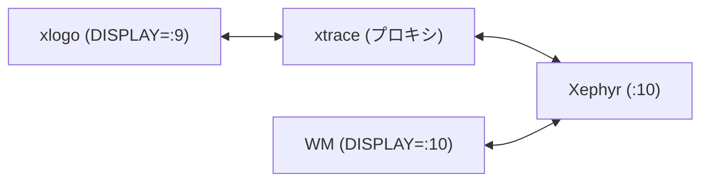
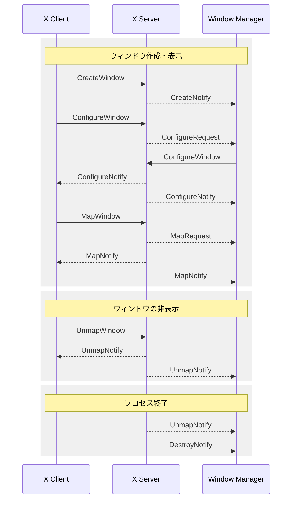

## はじめに

X11 では、サーバーがクライアントから受け取ったリクエストを Window
Manager にリダイレクトします。Window Manager はこのリダイレクトされた
リクエストを処理することで、任意のウィンドウレイアウト (たとえば、タイ
リング) を実現します。

X11 Protocol は、個々のリクエストやイベントの仕様を定義しています。し
かし、ウィンドウ作成などの実際の操作において、クライアント、サーバー、
Window Manager の三者間でどのようなやり取りが発生するかを、仕様のみか
ら把握することは難しいです。

そこで本記事では、ウィンドウの作成から削除までの間に、どのようなリクエ
ストやイベントが発生し、それらがクライアント、サーバー、Window Manager
の間でどのようにやり取りされるかを調査します。

## 調査方法

Xephyr、xtrace、およびシンプルな Window Manager を使って、クライアント、サーバー、Window Manager 間の通信を調査します。

```bash
# 1. Xephyr を起動
Xephyr :10 -screen 800x600 &

# 2. Window Manager を起動
DISPLAY=:10 RUST_LOG=debug rwm > ~/wm.log 2>&1 &

# 3. X アプリケーションを xtrace 経由で起動 (例: xlogo)
xtrace -n -d :10 -D :9 -o ~/xlogo-trace.log xlogo
```

構成は以下のとおりです。



xlogo と Window Manager が送受信したリクエストやイベントを記録することで、ウィンドウの作成時や削除時に、どのようなリクエストやイベントが発生するかを明らかにします。

Window Manager は下記を使用します。サーバーに接続して、受け取ったイベントを出力するシンプルなものです。

```rust
use anyhow::Result;
use tracing::{debug, error, info};
use x11rb::{
    connection::Connection,
    protocol::{
        xproto::{
            ChangeWindowAttributesAux, ConfigureRequestEvent, ConfigureWindowAux, ConnectionExt,
            EventMask, MapRequestEvent, UnmapNotifyEvent,
        },
        Event,
    },
    rust_connection::RustConnection,
};

struct WindowManager {
    conn: RustConnection,
}
impl WindowManager {
    fn new(conn: RustConnection, screen_num: usize) -> Result<Self> {
        // screen info
        let screen = &conn.setup().roots[screen_num];

        // Set SUBSTRUCTURE_REDIRECT/NOTIFY mask to become window manager
        let event_mask = EventMask::SUBSTRUCTURE_REDIRECT | EventMask::SUBSTRUCTURE_NOTIFY;
        let change = ChangeWindowAttributesAux::default().event_mask(event_mask);
        conn.change_window_attributes(screen.root, &change)?
            .check()?;
        info!("Successfully became window manager");

        Ok(Self { conn })
    }

    fn run(&mut self) -> Result<()> {
        loop {
            self.conn.flush()?;
            let event = self.conn.wait_for_event()?;

            if let Err(e) = self.handle_event(&event) {
                error!("Failed to handle event: {:?}", e);
            }
        }
    }

    fn handle_event(&mut self, event: &Event) -> Result<()> {
        match event {
            Event::ConfigureRequest(e) => self.handle_configure_request(e)?,
            Event::MapRequest(e) => self.handle_map_request(e)?,
            Event::UnmapNotify(e) => self.handle_unmap_notify(e)?,
            _ => debug!("[Unhandled] {:?}", event),
        }

        Ok(())
    }

    fn handle_configure_request(&self, event: &ConfigureRequestEvent) -> Result<()> {
        info!(
            "[ConfigureRequest] win={} size={}x{}",
            event.window, event.width, event.height
        );

        let change = ConfigureWindowAux::from_configure_request(event);
        self.conn.configure_window(event.window, &change)?.check()?;

        Ok(())
    }

    fn handle_map_request(&mut self, event: &MapRequestEvent) -> Result<()> {
        info!("[MapRequest] win={}", event.window);
        self.conn.map_window(event.window)?.check()?;

        Ok(())
    }

    fn handle_unmap_notify(&mut self, event: &UnmapNotifyEvent) -> Result<()> {
        info!("[UnmapNotify] window={}", event.window);

        Ok(())
    }
}

fn main() -> Result<()> {
    // Initialize tracing subscriber to enable logging
    tracing_subscriber::fmt::init();

    // Connect to X server using $DISPLAY
    let (conn, screen_num) = x11rb::connect(None)?;
    info!("Connected to X server with screen {:?}", screen_num);

    let mut wm = WindowManager::new(conn, screen_num)?;
    wm.run()?;

    Ok(())
}
```

## xlogo の調査

まず、シンプルな X アプリケーションである xlogo を使い、起動から終了までのウィンドウのライフサイクルを調査します。

xlogo を起動して `q` キーで終了させ、ログからライフサイクルに関連するリクエストやイベントを grep で抽出します。

```bash
grep -n "CreateWindow\|DestroyWindow\|DestroySubwindows\|MapWindow\|MapSubwindows\|UnmapWindow\|UnmapSubwindows\|ConfigureWindow\|CreateNotify\|DestroyNotify\|UnmapNotify\|MapNotify\|MapRequest\|ConfigureNotify\|ResizeRequest\|ConfigureRequest" ~/xlogo-trace.log
```

ここでは、ウィンドウのライフサイクルに関連する [Requests](https://www.x.org/releases/X11R7.7/doc/xproto/x11protocol.html#Requests) と [Events](https://www.x.org/releases/X11R7.7/doc/xproto/x11protocol.html#Events) を抽出しています。

結果として、`CreateWindow` と `MapWindow` は確認できましたが、`DestroyWindow` や `UnmapWindow` は見つかりませんでした。

`DestroyWindow` が発生しない理由を確認するため、xlogo のソースコード ([xorg/app/xlogo](https://gitlab.freedesktop.org/xorg/app/xlogo)) を調査しました。その結果、`q` キーでイベントループを抜け、`main()` から `return` して終了していることがわかりました。また、xlogo のコード全体を調査しても、Xlib の `XDestroyWindow` や X Toolkit の `XtDestroyWidget` などは呼び出されていませんでした。

一方、Window Manamger のログを確認したところ、xlogo 終了時に `UnmapNotify` と `DestroyNotify` が送信されていました。つまり、クライアントは `DestroyWindow` リクエストを送信していないが、サーバーがウィンドウを破棄し、Window Manager に通知していることがわかります。

## xterm の調査

次に、一部のウィンドウのみを閉じる場合の動作を確認するため、xterm でメニューを表示および非表示する操作を調査します。

xterm 上で Ctrl+ 右クリックを行いメニューを表示し、それを閉じてから `exit` コマンドで終了させ、xlogo と同様にログを抽出しました。

調査の結果、xterm は 3 つのウィンドウを作成していることがわかりました。メインウィンドウ (ルートウィンドウの子)、描画領域 (メインウィンドウの子)、そしてメニュー (ルートウィンドウの子、`override-redirect=true`) です。`override-redirect` はウィンドウの属性であり、Window Manager に対して管理対象外であることを示します。これにより、メニューが Window Manager によるレイアウトの対象にならないように制御されています。

メニューを閉じた際、ログには `UnmapWindow` が記録されていましたが、`DestroyWindow` は見つかりませんでした。このことから、メニューは非表示にされるだけで、ウィンドウ自体は破棄されずに残っていることがわかります。また、xterm 終了時にも `DestroyWindow` リクエストは送信されていませんでした。

## 調査結果のまとめ

xlogo と xterm の調査により、以下がわかりました。
- 調査したケースにおいて、アプリケーション終了時にクライアントは `DestroyWindow` リクエストを送信しなかった
- プロセス終了後、サーバーから Window Manager に `UnmapNotify` と `DestroyNotify` が送信された
- 一部のウィンドウ (メニューなど) を閉じる際、クライアントは`UnmapWindow` リクエストを使用し、Window 自体は破棄せずに残す場合がある

接続切断 (Connection Close) 時の動作については X11 Protocol の [Connection Close](https://www.x.org/releases/X11R7.7/doc/xproto/x11protocol.html#Connection_Close) に以下のように記載されています。

> If the mode is Destroy, all of the client's resources are destroyed.
>
> ...
>
> After save-set processing, all windows created by the client are destroyed.

ここでいう mode とは、接続が閉じられた際のクライアントリソースの扱いを定義する `close-down-mode` を指します ([SetCloseDownMode](https://www.x.org/releases/X11R7.7/doc/xproto/x11protocol.html#requests:SetCloseDownMode) 参照)。このモードのデフォルトは Destroy モードとなっています。つまり、接続が閉じられると、クライアントが作成したすべてのウィンドウは破棄されます。

これらの調査結果を踏まえ、次のセクションでは、ウィンドウのライフサイクル全体をシーケンス図で示します。

## ウィンドウのライフサイクル

以下は、クライアント、サーバー、Window Manager 間におけるリクエストやイベントの流れを示すシーケンス図です。実線の矢印はリクエスト、破線の矢印はイベントを表します。


