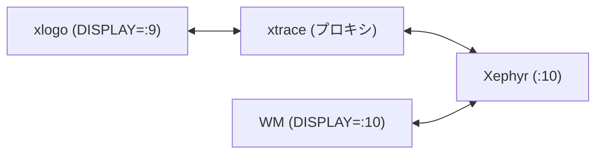
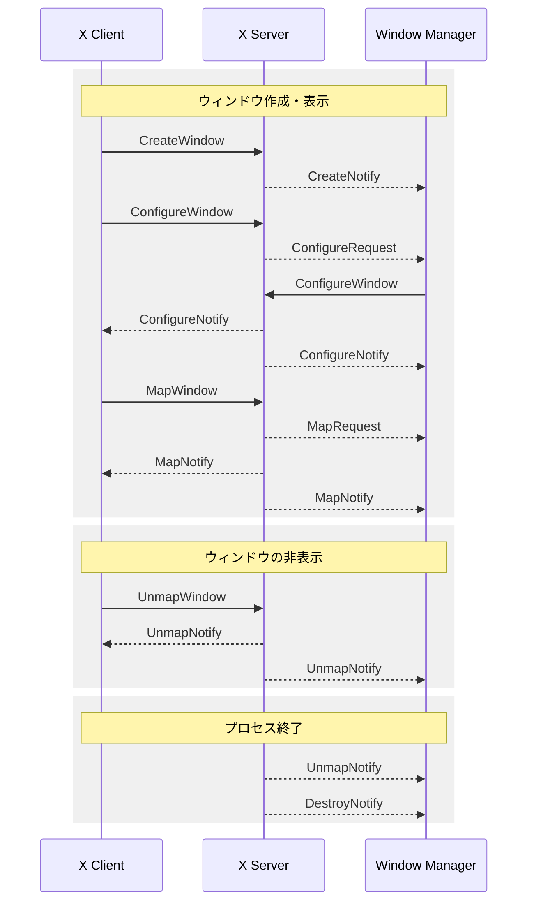

## はじめに

X11 では、サーバーがクライアントから受け取ったリクエストを Window
Manager にリダイレクトします。
Window Manager はこのリダイレクトされたリクエストを処理することで、
任意のウィンドウレイアウト (たとえば、
タイリング) を実現します。

X11 Protocol は、個々のリクエストやイベントの仕様を定義しています。
しかし、ウィンドウ作成などの実際の操作において、
クライアント、サーバー、
Window Manager の三者間でどのようなやり取りが発生するかを、
仕様のみから把握することは難しいです。

そこで本記事では、
ウィンドウの作成から削除までの間に、
どのようなリクエストやイベントが発生し、
それらがクライアント、
サーバー、Window Manager の間でどのようにやり取りされるかを調査します。

## 調査方法

Xephyr、xtrace、およびシンプルな Window Manager を使って、
クライアント、サーバー、
Window Manager 間の通信を調査します。

```bash
# 1. Xephyr を起動
Xephyr :10 -screen 800x600 &

# 2. Window Manager を起動
DISPLAY=:10 RUST_LOG=debug rwm > ~/wm.log 2>&1 &

# 3. X アプリケーションを xtrace 経由で起動 (例: xlogo)
xtrace -n -d :10 -D :9 -o ~/xlogo-trace.log xlogo
```

構成は以下のとおりです。



xlogo と Window Manager が送受信したリクエストやイベントを
記録することで、ウィンドウの作成時や削除時に、
どのようなリクエストやイベントが発生するかを明らかにします。

## xlogo の調査

まず、シンプルな X アプリケーションである xlogo を使い、
起動から終了までのウィンドウのライフサイクルを調査します。

xlogo を起動して `q` キーで終了させ、
ログからライフサイクルに関連するリクエストやイベントを grep で
抽出します。

```bash
grep -n "CreateWindow\|DestroyWindow\|DestroySubwindows\|MapWindow\|MapSubwindows\|UnmapWindow\|UnmapSubwindows\|ConfigureWindow\|CreateNotify\|DestroyNotify\|UnmapNotify\|MapNotify\|MapRequest\|ConfigureNotify\|ResizeRequest\|ConfigureRequest" ~/xlogo-trace.log
```

ここでは、ウィンドウのライフサイクルに関連する [Requests](https://
www.x.org/releases/X11R7.7/doc/xproto/x11protocol.html#Requests)
と [ Events](https://www.x.org/releases/X11R7.7/doc/xproto/
x11protocol. html#Events) を抽出しています。

結果として、`CreateWindow` と `MapWindow` は確認できましたが、
`DestroyWindow` や `UnmapWindow` は見つかりませんでした。

`DestroyWindow` が発生しない理由を確認するため、
xlogo のソースコード（ [xorg/app/xlogo](https://gitlab.freedesktop.
org/xorg/app/xlogo) ）を調査しました。
その結果、`q` キーでイベントループを抜け、
`main()` から `return` して終了していることがわかりました。
また、xlogo のコード全体を調査しても、
Xlib の `XDestroyWindow` や X Toolkit の `XtDestroyWidget` などは呼び
出されていませんでした。

一方、Window Manamger のログを確認したところ、
xlogo 終了時に `UnmapNotify` と `DestroyNotify` が送信されていました。
つまり、クライアントは `DestroyWindow` リクエストを送信していないが、
サーバーがウィンドウを破棄し、
Window Manager に通知していることがわかります。

## xterm の調査

次に、一部のウィンドウのみを閉じる場合の動作を確認するため、
xterm でメニューを表示および非表示する操作を調査します。

xterm 上で Ctrl+ 右クリックを行いメニューを表示し、
それを閉じてから `exit` コマンドで終了させ、
xlogo と同様にログを抽出しました。

調査の結果、xterm は 3 つのウィンドウを作成していることがわかりました。
メインウィンドウ (ルートウィンドウの子)、
描画領域 (メインウィンドウの子)、
そしてメニュー (ルートウィンドウの子、
`override-redirect=true`) です。
`override-redirect` はウィンドウの属性であり、
Window Manager に対して管理対象外であることを示します。
これにより、メニューが Window Manager によるレイアウトの
対象にならないように制御されています。

メニューを閉じた際、
ログには `UnmapWindow` が記録されていましたが、
`DestroyWindow` は見つかりませんでした。
このことから、メニューは非表示にされるだけで、
ウィンドウ自体は破棄されずに残っていることがわかります。
また、xterm 終了時にも `DestroyWindow` リクエストは
送信されていませんでした。

## 調査結果のまとめ

xlogo と xterm の調査により、
以下がわかりました。
- 調査したケースにおいて、アプリケーション終了時にクライアントは `DestroyWindow` リクエストを送信しなかった
- プロセス終了後、サーバーから Window Manager に `UnmapNotify` と `DestroyNotify` が送信された
- 一部のウィンドウ (メニューなど) を閉じる際、クライアントは `UnmapWindow` リクエストを使用し、Window 自体は破棄せずに残す場合がある

接続切断 (Connection Close) 時の動作については X11 Protocol の [Connection Close](
https://www.x.org/releases/X11R7.7/doc/xproto/x11protocol.html#
Connection_Close) に以下のように記載されています。

> If the mode is Destroy, all of the client's resources are destroyed.
>
> ...
>
> After save-set processing, all windows created by the client are destroyed.

ここでいう mode とは、
接続が閉じられた際のクライアントリソースの扱いを定義する `close-
down- mode` を指します ([SetCloseDownMode](https://www.x.org/
releases/X11R7. 7/doc/ xproto/ x11protocol.html#requests:
SetCloseDownMode) 参照)。
このモードのデフォルトは Destroy モードとなっています。
つまり、接続が閉じられると、
クライアントが作成したすべてのウィンドウは破棄されます。

これらの調査結果を踏まえ、
次のセクションでは、
ウィンドウのライフサイクル全体をシーケンス図で示します。

## ウィンドウのライフサイクル

以下は、クライアント、
サーバー、Window Manager 間におけるリクエストやイベントの流れを示す
シーケンス図です。
実線の矢印はリクエスト、
破線の矢印はイベントを表します。


