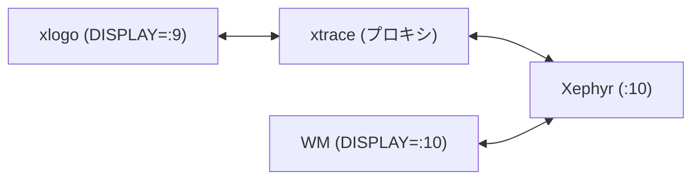
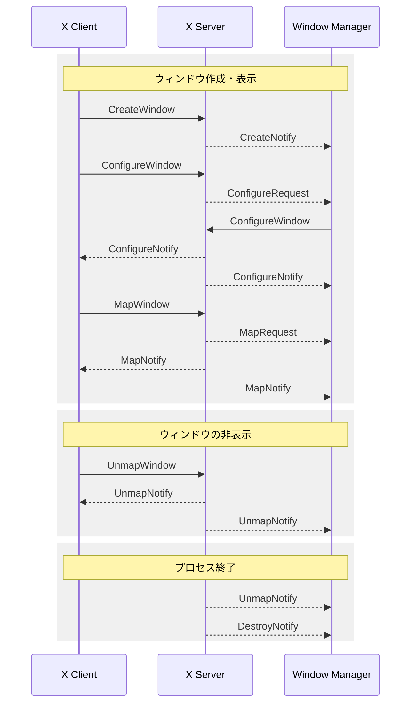

## はじめに

X11 における Window Manager は、クライアントがサーバーに送信したリクエストを、サーバーが Window Manager にリダイレクトすることで、タイル型のウィンドウ管理などを実現します。

X11 Protocol は仕様として主に個々のリクエスト・イベントについて説明しているため、クライアント・サーバー・Window Manager 間でやりとりされるリクエストやイベントがまとまっている訳ではありません。

そこで、本記事では、クライアントがウィンドウを作成してから、それが削除されるまでに、どのようなリクエスト・イベントが発生し、それらがクライアント・サーバー・Window Manager 間でどのようにやり取りされるかを調査します。

そして、Window Manager の目線でどのようなイベントをどうハンドリングするのがよいかについてまとめます。

## 調査方法

Xephyr、xtrace、およびシンプルな Window Manager を使って、クライアント・サーバー・WM 間の通信を調査します。

```bash
# 1. Xephyr を起動
Xephyr :10 -screen 800x600 &

# 2. Window Manager を起動
DISPLAY=:10 RUST_LOG=debug rwm > ~/wm.log 2>&1 &

# 3. X アプリケーションを xtrace 経由で起動 (例: xlogo)
xtrace -n -d :10 -D :9 -o ~/xlogo-trace.log xlogo
```

構成は以下のとおりです。



xlogo・WM が送受信したリクエスト・イベントを記録することで、ウィンドウ作成/削除時に、どのようなリクエスト・イベントが発生するかを明らかにします。

## xlogo の調査

まず、シンプルな X アプリケーションである xlogo を使って、起動から終了までのウィンドウライフサイクルを調査します。

xlogo を起動して `q` キーで終了させ、ログをライフサイクル関連のリクエスト・イベントで grep します。

```bash
grep -n "CreateWindow\|DestroyWindow\|DestroySubwindows\|MapWindow\|MapSubwindows\|UnmapWindow\|UnmapSubwindows\|ConfigureWindow\|CreateNotify\|DestroyNotify\|UnmapNotify\|MapNotify\|MapRequest\|ConfigureNotify\|ResizeRequest\|ConfigureRequest" ~/xlogo-trace.log
```

ここでは、ウィンドウのライフサイクルに関連する [Requests](https://www.x.org/releases/X11R7.7/doc/xproto/x11protocol.html#Requests) と [Events](https://www.x.org/releases/X11R7.7/doc/xproto/x11protocol.html#Events) を grep しています。

grep の結果、`CreateWindow` と `MapWindow` は確認できましたが、`DestroyWindow` や `UnmapWindow` は見つかりませんでした。

なぜ DestroyWindow が呼ばれないのか確認するため、xlogo のソースコード（[xorg/app/xlogo](https://gitlab.freedesktop.org/xorg/app/xlogo)）を調査したところ、`q` キーでイベントループを抜けて `main()` から `return` するだけであることがわかりました。また、xlogo のコード全体を grep したところ、Xlib のクリーンアップ関数 (`XDestroyWindow` など) や X toolkit のクリーンアップ関数 (`XtDestroyWidget` など) は呼ばれていないようでした。

一方、WM のログを確認したところ、xlogo 終了時に `UnmapNotify` と `DestroyNotify` が送られていました。つまり、クライアントは DestroyWindow などを呼んでいないが、X サーバーがウィンドウを破棄し、WM に通知していることがわかります。

## xterm の調査

次に、一部のウィンドウだけを閉じる場合の動作を確認するため、xterm でメニューを表示・非表示する操作を調査します。

xterm で Ctrl+右クリックでメニューを表示し、閉じてから `exit` で終了させ、同様に grep しました。

その結果、xterm は 3 つの Window を作成していることがわかりました。メインウィンドウ (root の子)、描画領域 (メインウィンドウの子)、そしてメニュー (root の子、`override-redirect=true`) です。`override-redirect` は Window の attribute で、Window Manager に対して「このウィンドウには干渉しないで」と伝えるものです。これにより、メニューが WM によるレイアウトの対象にならないようにしています。

メニューを閉じた時、ログには `UnmapWindow` が記録されていましたが、`DestroyWindow` は見つかりませんでした。そのため、メニューは非表示にされるだけで、Window 自体は破棄されずに残っています。また、xterm 終了時も `DestroyWindow` は呼ばれていませんでした。

## 調査結果のまとめ

xlogo と xterm の調査により、以下がわかりました。
- 今回調査したケースでは、アプリケーション終了時にクライアントは明示的に `DestroyWindow` を呼ばなかった
- プロセス終了後、サーバーから WM に `UnmapNotify` と `DestroyNotify` が送信された
- 一部のウィンドウ (メニューなど) を閉じる時は `UnmapWindow` を使い、Window 自体は破棄せずに残すことがある

Connection Close 時の動作は X11 Protocol の [Connection Close](https://www.x.org/releases/X11R7.7/doc/xproto/x11protocol.html#Connection_Close) に書かれています。

> If the mode is Destroy, all of the client's resources are destroyed.
>
> ...
>
> After save-set processing, all windows created by the client are destroyed.

ここで mode は close-down-mode を指します。これは接続が閉じられたときにクライアントのリソースをどう扱うかを定義するもので（[SetCloseDownMode](https://www.x.org/releases/X11R7.7/doc/xproto/x11protocol.html#requests:SetCloseDownMode) 参照）、デフォルトでは Destroy mode です。つまり、接続が閉じられると、クライアントが作成した全ての Window が破棄されます。

これらの調査結果を踏まえて、次のセクションでウィンドウのライフサイクル全体をシーケンス図で示します。

## ウィンドウのライフサイクル

以下は、X Client、X Server、Window Manager 間のリクエスト・イベントの流れを示すシーケンス図です。実線の矢印は Request、破線の矢印は Event を表します。


## まとめ

<!-- TODO: まとめる -->
